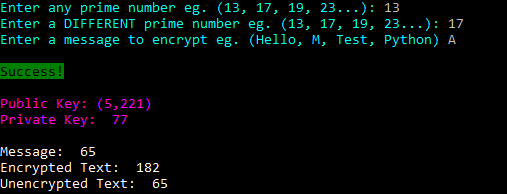

# RSA-Encryption-Python
Program that encrypts and decrypts user input using RSA.

## Description
The program calculates the private and public keys based on user inputted primes and encrypts a users string and then decrypts it.

#### RSA_Keygen
Calculates the private and public key by searching for the smallest value of e (part of public key) and uses the extended Euclidean method to calculate d (private key).

#### RSA_Encryption
Takes in a message and a key to encrypt or decrypt the message.

#### EncryptionTest
Takes two primes from the user and a message and encrypts the message and then decrypts it.

## Technologies Used
Python

## License
This project is licensed under the GNU General Public License v3.0 - see the LICENSE file for details
